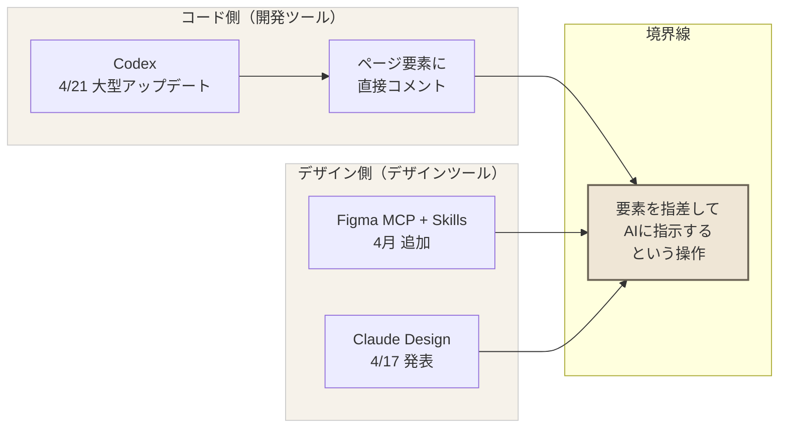

# diagram: 20260424_a20260422-01

## 判定
**構造図**（概念説明系）

記事の核は「コード側とデザイン側、両方から境界線に寄ってきている」という対称構造。左右対称の構造図で表現するのが最もわかりやすい。

## Mermaid



→ noteはMermaid非対応のため、**Canvaで手作りする**。下記レイアウト指示を使う。

## Canvaレイアウト指示

```
【Canvaで作る場合】
- 図の種類: 左右対称の構造図（3カラム：左・中央・右）
- ボックス数: 5個（左2・中央1・右2）
- 配置: 左→中央・右→中央（矢印2本ずつ + 中央は大きめ）
- 色: ciroトーン
    - 背景: オフホワイト (#F6F2EA)
    - ボックス枠: グレー (#CCCCCC)
    - 中央ボックスのみアクセント: 温かみのあるベージュ (#EFE6D6)
    - テキスト: ダークグレー (#3A3A3A)
- フォント: Noto Sans JP Regular（見出しはMedium）
- テキスト量: 各ボックス1行以内
    - 左上「Codex 4/21」
    - 左下「ページ要素に直接コメント」
    - 中央（大）「要素を指差して AIに指示する」
    - 右上「Figma MCP + Skills」
    - 右下「Claude Design 4/17」
- 上部に小見出し「コード側」「境界線」「デザイン側」を配置
- 矢印はシンプルな細線（#6B6355）
```

## キャプション（noteに添える1行）

> コード側（Codex）とデザイン側（Figma／Claude Design）が、同じ「要素を指差して指示する」操作に向かって寄ってきている。
