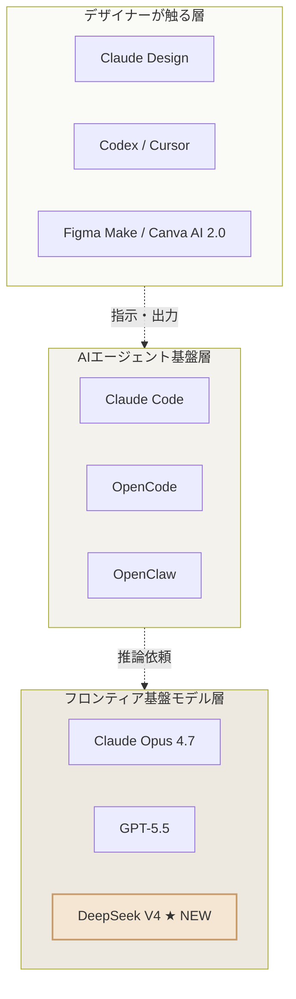

# diagram — a20260425-01「DeepSeek V4が変える、AIツール選びの足元」

## 判定
記事は「基盤モデル → デザインAIツール → デザイナーの操作」という階層構造を説明している。**構造図** が最適（フロー図ではなく階層・関係を見せるレイヤー図）。

---

## Mermaid（構造図）



→ **note は Mermaid 非対応**のため、Canva で手作りする際の指示を以下に添える。

---

## Canvaで作る場合

```
- 図の種類: 3層レイヤー図（縦積み・上から下へ）
- ボックス数: 上段3個 / 中段3個 / 下段3個（合計9個）
- 配置: 上→下 で「デザイナー操作 → エージェント基盤 → 基盤モデル」
- 各層にラベル帯（左端に縦書き or 左上に層名のみ）
- 矢印: 上から下へ点線（依存関係を示す・濃すぎないグレー）
- 色: ciroトーン
    - 背景: オフホワイト #faf9f5
    - 上層ボックス: ベージュ薄 #f4f0e8
    - 中層ボックス: ベージュ中 #ebe2d0
    - 下層ボックス: ベージュ濃 #ddd0b6
    - 強調(DeepSeek V4): アクセント色 #c89b6a で枠線のみ
- テキスト量: 各ボックス1行・サービス名のみ
- フォント: 見出し Noto Sans JP Bold / 本文 Noto Sans JP Regular
- キャプション: 図の下に1行「DeepSeek V4 はいちばん下、デザイナーから見えない層で動く」
```

## 制約チェック
- [x] 1記事1点
- [x] 専門用語キャプションあり（「基盤モデル」「エージェント基盤」）
- [x] シンプル・余白多め
