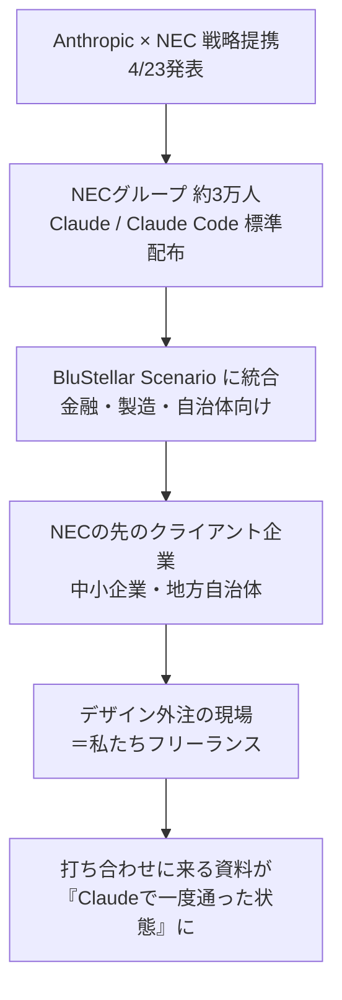

# 図 — NEC×Anthropic提携がフリーランスに届くまで（構造図）

## 判定
- 種類: 構造図（影響の連鎖を可視化）
- 理由: 「上流のAI採用が、どう私たちの打ち合わせまで届くか」が記事の核。フロー図で連鎖を見せると一発で伝わる。

## Mermaid（noteは非対応のためCanvaで再現する）



## Canvaで作る場合

```
【Canvaで作る場合】
- 図の種類: 縦方向フロー（5〜6ボックス）
- ボックス数: 6個
- 配置: 上→下（影響の上流から下流）
- 色: ciroトーン（ベージュ #F5EFE6 / オフホワイト #FAFAF7 / グレー #6B6B6B ＋ アクセント1色のみ）
- アクセント: 一番下（フリーランスの現場）にだけ濃色を当てて視線を落とす
- テキスト量: 各ボックス1〜2行
- 矢印: 細め・グレー、影なし
- フォント: 日本語ゴシック（Noto Sans JP Medium）
- 余白: 各ボックス上下に十分な余白、詰め込まない
```

## キャプション案
「NECが3万人にClaudeを配ると、何段か先で私たちの打ち合わせが変わる」
